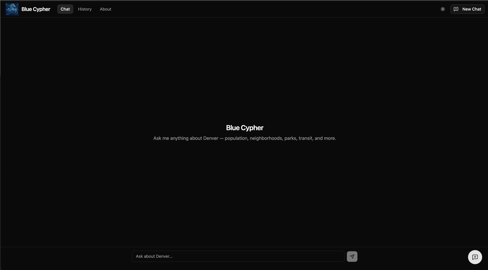

<div align="center">


<h1>Blue Cypher</h1>

<p><strong>An AI assistant for exploring Denver.</strong> Ask about neighborhoods, transit, parks, and city data — and get streaming, source-backed answers.</p>

<p>
  
  
  
  
  
  
</p>

<p>
  <a href="https://bluecypher.ai/"><strong>Live URL</strong></a> ·
  <a href="https://github.com/uelski/den_bot_server"><strong>Backend Repo</strong></a>
</p>

</div>

---

## Overview

Blue Cypher is the web client for an AI system that answers natural-language questions about the city of Denver. A user asks something like *"What's the population of Five Points?"* or *"Are there any RTD alerts right now?"*, and the app streams back an answer assembled by a retrieval-augmented backend — complete with citations to official data sources, transit-aware tool calls, and links to interactive maps.

This repository is the **frontend**: a single-page React app that handles the real-time streaming UI, conversation state, and history. It talks to a separate [FastAPI + LangGraph + Qdrant backend](https://github.com/uelski/den_bot_server) over server-sent events.

<div align="center">
  
</div>

## Features

- 💬 **Real-time streaming chat** — answers render token-by-token as the LLM generates them, with a live "thinking" cursor.
- 🔧 **Transparent tool use** — when the backend checks RTD arrivals, weather, or searches denvergov.org, the UI surfaces what's happening (*"Checking RTD alerts…"*).
- 📚 **Source citations** — responses link back to the official datasets and pages they were grounded in.
- 🗺️ **Map links** — relevant answers surface deep links to interactive maps (parks, RTD stops/routes).
- 🕘 **Conversation history** — past chats persist locally and reload on demand.
- 🌗 **Light / dark theme** and a **mobile-responsive** layout.
- 🐛 **Built-in feedback** — a lightweight panel for reporting bugs, suggesting data sources, and more.

## How it works

A few engineering decisions worth calling out:

- **SSE over `fetch`, not `EventSource`.** The chat endpoint needs a POST with a JSON body, which `EventSource` can't do (GET only). The streaming client is built on `fetch` + `ReadableStream.getReader()`, parsing the SSE wire format by hand — including a structured event protocol (`token`, `tool_call`, `tool_result`, `sources`, `map_viewer`, `done`, `error`).
- **`useReducer` for streaming state.** Tokens arrive every 20–80 ms. A `useState` approach risks stale closures under that dispatch rate, so chat state is driven by a reducer that always sees the latest state.
- **Render performance under streaming.** Only the in-flight message re-renders per token; all prior messages are memoized with `React.memo`. Auto-scroll runs on a throttled interval (not per-token) and yields to the user — scroll up and it pauses, surfacing a "scroll to bottom" affordance.
- **Pluggable API layer.** A single `ChatApiInterface` has both a mock and a real implementation, swapped via an environment variable. The entire UI can be developed and tested without the backend running — and the mock powers deterministic end-to-end tests.

## Tech stack

| | |
|---|---|
| **Framework** | React 19, TypeScript 5.9, Vite 7 |
| **Styling** | Tailwind CSS v4 (Vite plugin, no config file), shadcn/ui (New York / Zinc) |
| **Routing** | React Router v7 |
| **State** | React Context + `useReducer` (no external state library) |
| **Testing** | Vitest + Testing Library (142 tests / 26 files), Playwright (E2E) |
| **Tooling** | ESLint 9, Yarn 4, Node ≥ 22 |
| **Hosting** | Cloudflare Workers (static assets + SPA fallback) via Workers Builds |

## Getting started

```bash
nvm use 22          # Node ≥ 22 is required
yarn install
yarn dev            # start the dev server (defaults to the mock API)
```

The app runs against a **mock streaming API** out of the box, so no backend is needed to explore it locally. To point at a real backend, set the environment variables below.

### Environment variables

Copy `.env.example` to `.env`. All variables are read by Vite at build time.

| Variable | Default | Description |
|----------|---------|-------------|
| `VITE_USE_MOCK_API` | `true` | Use the mock streaming API; set `false` to call the real backend |
| `VITE_API_BASE_URL` | `http://localhost:8000` | Backend API base URL |

## Testing

```bash
yarn test           # unit/component tests in watch mode
yarn test:run       # unit/component tests once (CI)
yarn e2e            # Playwright E2E suite (builds + serves, runs against the mock API)
yarn e2e:ui         # interactive Playwright runner
```

Unit and component tests live beside the code (`src/**/*.test.{ts,tsx}`). End-to-end specs (`e2e/**/*.spec.ts`) exercise the production bundle in a real browser against the mock API, so they're deterministic and need no backend.

## Deployment

Deployed as static assets on **Cloudflare Workers** via Workers Builds — pushes to `main` build and deploy automatically, and PRs get preview deployments. SPA routing is handled by `wrangler.jsonc` (`not_found_handling: "single-page-application"`). See [`deployment.md`](deployment.md) for the full setup.

```bash
yarn build          # type-check + production build
yarn preview        # preview the production build locally
```

## The bigger picture

Blue Cypher is a two-part system:

- **Frontend** (this repo) — the streaming chat UI.
- **[Backend](https://github.com/uelski/den_bot_server)** — a FastAPI service running a LangGraph agent over a Qdrant vector store, which retrieves Denver open data, calls live transit/weather tools, and streams grounded responses.

Data comes from public, official sources including the [Denver Open Data Catalog](https://opendata-geospatialdenver.hub.arcgis.com/), [RTD Open Spatial Data](https://www.rtd-denver.com/open-records/open-spatial-information), and [denvergov.org](https://denvergov.org/Home).

> **Note:** Blue Cypher is in active development. AI can make mistakes — verify anything important against the linked sources.

## License

Released under the [MIT License](LICENSE).
